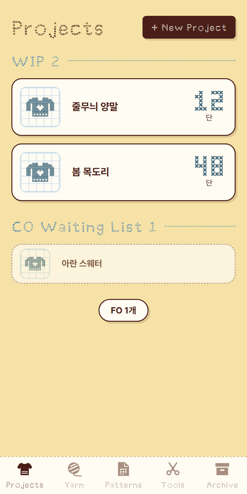
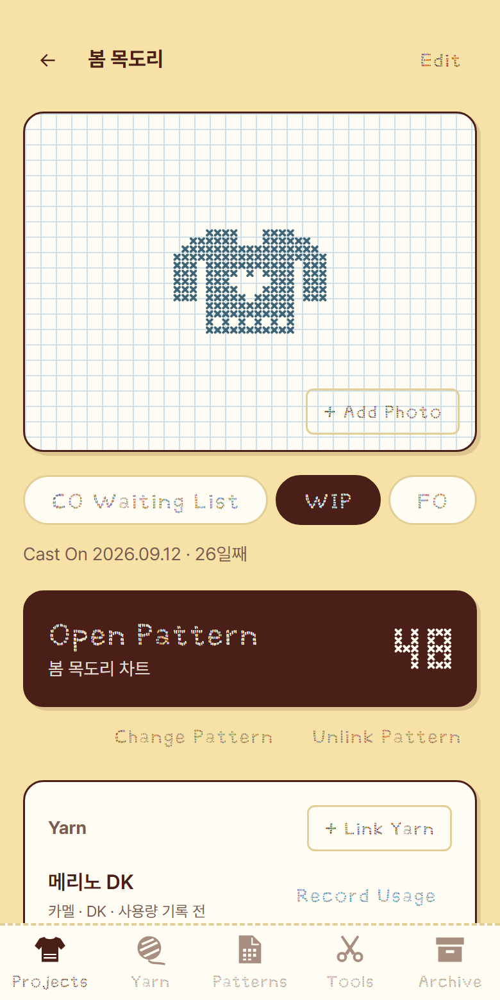
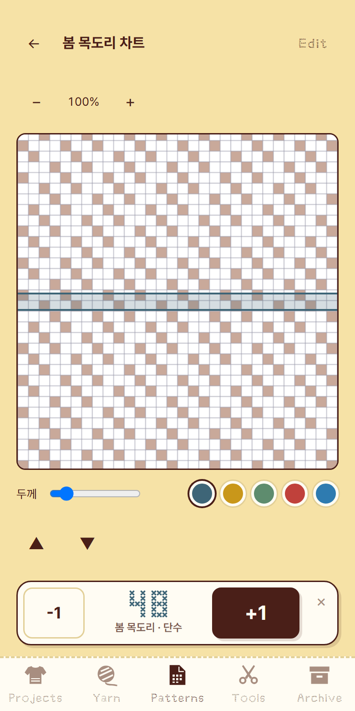
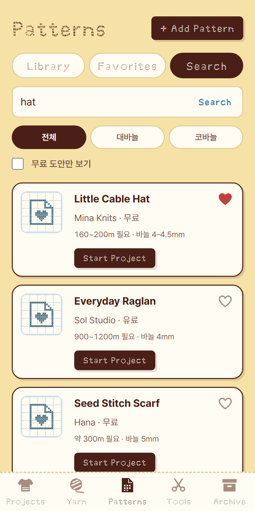

<div align="center">

# 🧶 실실 SilSil

**실이 쌓일수록 실실 웃게 되는 뜨개 기록 앱.**<br>뜨고 있는 작품, 실, 도안, 단수를 한곳에.<br>
뜨개하는 사람이 쓰려고 직접 만든, 모눈종이 위 십자수 같은 앱이에요.

### 👉 [지금 바로 열기](https://seungaeahn.github.io/k_web/)

회원가입 없음 · 무료 · 데이터는 내 기기에만 저장

</div>

<p align="center">
  
  
  
  
</p>

---

## 이런 분께 좋아요

- 뜨고 있는 작품이 여러 개라 **어디까지 떴는지** 자꾸 헷갈리는 분
- 도안을 보면서 **지금 몇 단째인지** 손으로 세기 번거로운 분
- 실은 쌓여 가는데 **뭐가 얼마나 남았는지** 모르겠는 분
- Ravelry에서 찜한 도안을 **바로 작품으로 시작**하고 싶은 분

## 3단계로 시작하기

**1. 열기**
아이패드·아이폰은 **Safari**로, 안드로이드는 Chrome으로 👉 https://seungaeahn.github.io/k_web/

**2. 홈 화면에 추가하기** (꼭 해주세요!)
- 아이패드·아이폰: 공유 버튼 <kbd>⬆️</kbd> → **홈 화면에 추가** → 추가
- 안드로이드: Chrome 메뉴 <kbd>⋮</kbd> → **앱 설치**

이제 홈 화면 아이콘으로 열면 주소창 없이 앱처럼 열리고, 인터넷이 없어도 쓸 수 있어요.

**3. 첫 작품 만들기**
Projects 탭에서 **+ New Project**를 누르거나, Patterns 탭에서 도안을 고르고 **Start Project**를 누르면 돼요.

---

## 이렇게 써요

### 🧶 작품은 CO → WIP → FO로
| 단계 | 뜻 | 앱에서는 |
| --- | --- | --- |
| **CO Waiting List** | 코를 잡기 전, 뜰 예정 | 뜨고 싶은 작품을 모아두는 목록. **Cast On**을 누르면 시작! |
| **WIP** | 뜨는 중 | **Open Pattern**으로 바로 도안을 열고 단수를 세요 |
| **FO** | 완성 | 쓴 실의 양을 기록하면 Archive의 유리병에 실타래로 쌓이고, 사진은 Archive › Gallery에 모여요. 인스타그램 게시글도 붙일 수 있어요 |

### 🪡 십자수 샘플러
- FO에 쓴 실을 기록하면 **50g(1볼) = 5땀**씩 샘플러에 수놓아져요. 볼 단위 실은 볼당 무게로, 콘사는 g 그대로 계산해요.
- 차트처럼 아래 단부터 한 땀씩 채워지고, 다 채우면 숨어 있던 **뜨개 친구**가 튀어나와요.
- **Archive › Jar**에는 작품을 완성할 때마다 그 실 색의 실타래가 하나씩 쌓이는 **유리병**이 있어요. 실을 많이 쓴 작품일수록 실타래가 크고, 병이 가득 차면 새 병을 채워요. 샘플러를 완성해 만난 친구들도 그 무렵 실타래들 사이로 병에 들어가요. 병을 톡 건드리면 안에 든 실타래와 친구들이 출렁여요. 친구를 누르면 내 기록으로 말을 걸어요. 완성한 날짜와 이야기는 **Sampler Album**에서 볼 수 있어요. 장(Chapter)이 넘어갈수록 모눈이 커져요.

### 📄 도안을 보면서 단수 세기
- 이미지나 PDF 도안을 올려두고 앱 안에서 봐요.
- 지금 뜨는 단에 **하이라이트 줄**을 놓아요. (색 5가지, 두께 조절)
- **+ Row Counter**로 단수 카운터를 켜면, **+1**을 누를 때마다 줄이 한 칸 위로 올라가요. 뜨개 차트는 아래에서 위로 읽으니까요!
- 화면이 꺼지지 않게 해둬서 뜨는 동안 계속 볼 수 있어요.

### 💛 Ravelry 도안 찾기 → 바로 시작
- Patterns › **Search**에서 Ravelry 도안을 검색하고 하트로 찜해요.
- **Start Project**를 누르면 작품 이름, 바늘, 도안이 채워진 채로 새 작품이 만들어져요.
- 바늘 굵기와 필요한 실 양도 같이 보여줘요.

### 🧵 실 보관함
- 실마다 색, 굵기(Lace ~ Super Bulky), 권장 바늘, 소재, 보유량을 적어둬요.
- 보유량은 **볼**로도, **g(콘사)**로도 관리할 수 있어요.
- 작품에 실을 연결해두고, **다 뜨고 나서 쓴 양을 기록**해요. 콘사는 남은 무게를 저울에 올려 적기만 하면 쓴 양을 계산해줘요.
- "이 실로 뜰 도안 찾기"로 갖고 있는 실에 맞는 Ravelry 도안을 추천받아요.

### 🛠 Tools
- **Gauge Calculator**: 스와치 게이지로 필요한 코 수·단 수 계산
- **Abbreviations**: k2tog, ssk 같은 뜨개 약어 사전
- **Backup**: 데이터 내보내기·가져오기
- **Ravelry**: Ravelry 연동 설정

---

## 자주 묻는 질문

<details>
<summary><b>내 데이터는 어디에 저장되나요?</b></summary>

지금 쓰고 있는 **기기의 브라우저 안**에만 저장돼요. 서버로 보내지 않고, 다른 사람이 볼 수 없어요.
대신 기기끼리 자동으로 맞춰지지 않아요. 아이패드와 폰은 각각 따로 저장돼요.
</details>

<details>
<summary><b>데이터가 사라질 수도 있나요?</b></summary>

이럴 때는 사라질 수 있어요.
- Safari에서 방문 기록·웹사이트 데이터를 지울 때
- 기기를 초기화하거나 바꿀 때
- **홈 화면에 추가하지 않고** Safari 탭으로만 오래 안 쓸 때 (iOS가 7일 넘게 안 쓴 웹사이트 데이터를 지울 수 있어요)

그래서 **홈 화면에 추가해서 쓰고**, 가끔 **Tools › Backup**에서 백업 파일을 내보내 iCloud Drive나 구글 드라이브에 보관해 두세요. 30일 동안 백업을 안 하면 앱이 알려줘요.
</details>

<details>
<summary><b>다른 기기로 옮기고 싶어요.</b></summary>

1. 쓰던 기기에서 **Tools › Backup › Export Data**로 백업 파일을 저장해요.
2. 새 기기에서 앱을 열고 **Tools › Backup › Choose Backup File**로 그 파일을 골라요.

가져오기를 하면 새 기기에 있던 데이터는 백업 내용으로 **바뀌어요.** 도안 파일, 찜한 도안까지 같이 옮겨져요.
</details>

<details>
<summary><b>Ravelry 연동은 꼭 해야 하나요?</b></summary>

아니요, **선택**이에요. 작품, 실, 도안 파일, 단수 카운터는 연동 없이도 다 쓸 수 있어요.
Ravelry 도안 검색·찜, 실 정보 불러오기를 쓰고 싶을 때만 설정하면 돼요.

1. [Ravelry 개발자 페이지](https://www.ravelry.com/pro/developer)에서 **읽기 전용(read-only)** 개인 키를 발급받아요.
2. 앱의 **Tools › Ravelry**에 API 액세스 키와 API 시크릿을 넣고 **Test Connection**을 눌러요.

키는 내 기기에만 저장되고, 백업 파일에도 들어가지 않아요.
</details>

<details>
<summary><b>굿노트로 도안을 보는데 같이 쓸 수 있나요?</b></summary>

아이패드 **화면 분할(Split View)**로 굿노트와 이 앱을 나란히 띄워 보세요. 도안은 굿노트에서 보고, 단수와 작품 기록은 이 앱에서 하면 돼요.
</details>

<details>
<summary><b>앱 스토어에서 받을 수 있나요?</b></summary>

스토어 앱은 아니에요. 대신 **홈 화면에 추가**하면 스토어 앱처럼 아이콘으로 열리고, 오프라인에서도 동작해요. 새 버전은 인터넷이 될 때 알아서 받아서, 다음에 열 때 반영돼요.
</details>

---

<details>
<summary><b>🧑‍💻 개발자용 정보</b></summary>

### 만든 방식
빌드 도구 없이 순수 HTML·CSS·JavaScript로 만든 PWA예요.

```bash
# 로컬에서 실행 (Node.js 필요)
node scripts/serve.js 8080
# → http://localhost:8080
```

- `master` 브랜치에 푸시하면 GitHub Pages에 자동으로 배포돼요.
- 코드를 바꾸면 `sw.js`의 `CACHE_NAME` 버전을 올려야 설치된 앱에도 새 버전이 반영돼요.
- 주소 끝에 `?demo`(샘플러 전부 완성)나 `?demo=half`(진행 중)를 붙이면 목업 데이터로 열려요. 메모리에만 저장돼서 실제 기록은 건드리지 않아요.
- 자동 테스트: `node tests/run.js` (설치할 것 없음, Chrome으로 실행). 테스트 케이스는 [docs/TESTCASES.md](docs/TESTCASES.md)에 있어요.

### 폴더 구조
```
index.html            앱 화면 틀, 하단 탭
manifest.webmanifest  홈 화면 앱 설정 (이름, 아이콘, 색)
sw.js                 서비스 워커 (오프라인 캐시)
css/style.css         디자인 토큰과 전체 스타일
css/MUNMAK_DALBANCHE.ttf  영어 제목·버튼용 글꼴
js/app.js             화면 (라우터, 각 화면 그리기, 이벤트)
js/storage.js         데이터 저장·백업 (localStorage)
js/filestore.js       도안 파일 저장 (IndexedDB)
js/ravelry.js         Ravelry API
js/icons.js           실루엣 아이콘, 십자수 그림·숫자
js/modal.js           팝업, 고르기 창
js/sampler.js         십자수 샘플러 (도안, 땀 계산)
js/characters.js      뜨개 친구 캐릭터 (임시 SVG, 손그림 PNG로 교체 가능)
js/yarnjar.js         Archive 실타래 유리병 그림
js/demo.js            데모 모드 목업 데이터
js/utils.js           날짜·문자열 도우미
vendor/pdfjs/         PDF 도안 표시 (pdf.js 3.11.174)
scripts/              로컬 서버, 아이콘 생성
tests/                자동 테스트 (node tests/run.js)
docs/screenshots/     README 화면 캡처
```

### 디자인
- 버터 바탕, 실타래 갈색, 슬레이트 블루 십자수 색의 "모눈종이" 디자인 시스템 (`css/style.css` 맨 위 토큰)
- 본문: [Pretendard](https://github.com/orioncactus/pretendard) · 영어 제목·버튼: 문막 달반체
- 빈 화면·썸네일의 십자수 그림은 `js/icons.js`의 칸 배열(`STITCHES`)로 그려요.
</details>

<sub>이 앱은 Ravelry에서 만들거나 제휴·보증한 앱이 아니에요. Ravelry 검색 결과는 Ravelry API로 가져와요.</sub>
